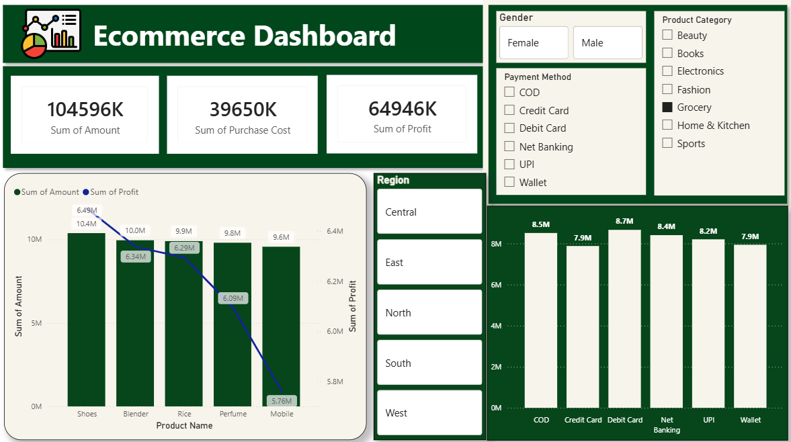

# Ecommerce Sales & Profit Analysis Dashboard
## Project Overview
This project is an interactive Ecommerce Sales and Profit Analysis Dashboard developed using Microsoft Power BI.
The dashboard helps analyze ecommerce business performance based on sales amount, purchase cost, profit, product categories, payment methods, gender, and regions.
The objective is to convert raw ecommerce data into meaningful business insights through interactive visualizations and KPIs.
---
## Business Problem
An ecommerce company generates a large amount of sales transaction data from different products, customers, payment methods, and regions.
The business wants to understand:
- Overall sales performance
- Purchase cost and profitability
- Product-wise sales and profit
- Payment method performance
- Customer gender distribution
- Product category performance
- Regional performance
A Power BI dashboard can help management monitor these metrics and make better data-driven decisions.
---
##  Tools & Technologies
- Microsoft Power BI
- Power Query
- DAX
- Microsoft Excel 
- Data Visualization
- Data Cleaning
- Data Analysis
---
## Dashboard Features
### KPI Cards
The dashboard displays:
- Total Sales Amount
- Total Purchase Cost
- Total Profit
### Interactive Filters
Users can filter the dashboard using:
- Gender
- Product Category
- Payment Method
- Region
### Visualizations
The dashboard includes:
- Product-wise Sales Amount
- Product-wise Profit
- Payment Method Analysis
- Regional Analysis
- Category Filtering
- Gender Filtering
---
##  Key Business Questions
1. What is the total sales amount?
2. What is the total purchase cost?
3. What is the total profit?
4. Which product generates the highest sales?
5. Which product generates the highest profit?
6. Which payment method has the highest sales?
7. How does performance vary by region?
8. Which product category performs better?
9. How does sales performance vary between male and female customers?
10. Which products should the business focus on?
---

## Dashboard Preview

---
### Data Available
- Product Name – Name of the product
- Product Category – Category such as Electronics, Fashion, Grocery, etc.
- Gender – Customer gender
- Region – Customer/business region
- Payment Method – COD, Credit Card, Debit Card, Net Banking, UPI, Wallet
- Amount – Total sales amount
- Purchase Cost – Cost associated with purchasing the product
- Profit – Profit generated from the transaction
---
## Root Cause Summary
The main causes of variation in ecommerce performance are differences in product profitability, purchase costs, payment preferences, product categories, customer segments, and regional demand. Analyzing these factors together helps identify the reasons behind higher or lower sales and profit.
---
##  Project Structure
```text
Dashboard/Dataset/Images/Documentation/README.md
